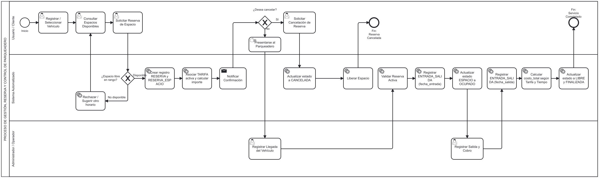

# Sistema de Gestión y Reserva de Parqueaderos

## Descripción del dominio

El sistema permite gestionar y reservar espacios de parqueaderos de manera organizada.
Los usuarios pueden registrar sus vehículos y consultar los espacios disponibles.
También pueden realizar, consultar y cancelar reservas para un espacio determinado.
Los administradores pueden gestionar espacios, tarifas, reservas y registrar las entradas y salidas de los vehículos.
El sistema busca evitar conflictos de reservas y calcular correctamente el costo del servicio según las tarifas establecidas.

---

## 🚀 API REST (Express)

El proyecto cuenta con una API REST desarrollada en Node.js utilizando **Express**, estructurada bajo una arquitectura de tres capas.

### Arquitectura de Capas
- **Routes (`src/routes/`)**: Define las URLs y métodos HTTP de los endpoints.
- **Controllers (`src/controllers/`)**: Capa de presentación HTTP. Recibe la petición (`req`), extrae parámetros/body, llama al servicio y formatea la respuesta (`res`) manejando los códigos de estado HTTP correspondientes.
- **Services (`src/services/`)**: Capa de negocio y datos. Ejecuta las validaciones de negocio del dominio, procesa la información y no tiene conocimiento del contexto HTTP.

### Middlewares Implementados
- **Morgan**: Registro de peticiones HTTP en consola.
- **Modo Mantenimiento**: Middleware global (`src/middlewares/mantenimiento.js`) que bloquea la API con un código `503` si la variable de entorno `MANTENIMIENTO=true` está configurada.
- **API Key**: Middleware de protección (`src/middlewares/apiKey.js`) aplicado específicamente a rutas sensibles (ej: `DELETE /api/espacios`), exigiendo el header `x-api-key`.

### Endpoints (CRUD de Espacios)

| Método | Endpoint | Descripción |
|---|---|---|
| `GET` | `/` | Estado de la API |
| `GET` | `/api/espacios` | Listar todos los espacios |
| `GET` | `/api/espacios?estado=libre` | Filtrar espacios por estado (ej: libre, ocupado) |
| `GET` | `/api/espacios?tipo=moto` | Filtrar espacios por tipo (ej: carro, moto) |
| `GET` | `/api/espacios/:id` | Ver detalles de un espacio específico |
| `POST` | `/api/espacios` | Crear un nuevo espacio (aplica validaciones de negocio) |
| `PUT` | `/api/espacios/:id` | Actualizar la información de un espacio existente |
| `DELETE` | `/api/espacios/:id` | Eliminar un espacio (Requiere Header: `x-api-key: secreta123`) |

### Cómo ejecutar el proyecto

1. Instalar las dependencias:
   ```bash
   npm install
   ```
2. Arrancar el servidor en modo desarrollo (con auto-recarga gracias a Nodemon):
   ```bash
   npm run dev
   ```
3. La API estará disponible en: `http://localhost:3000`

---

## Diagramas

Los diagramas de diseño del proyecto se encuentran en la carpeta `docs/`.

### Diagrama de casos de uso


### Diagrama de secuencia


### Diagrama de clases


### Diagrama BPMN

