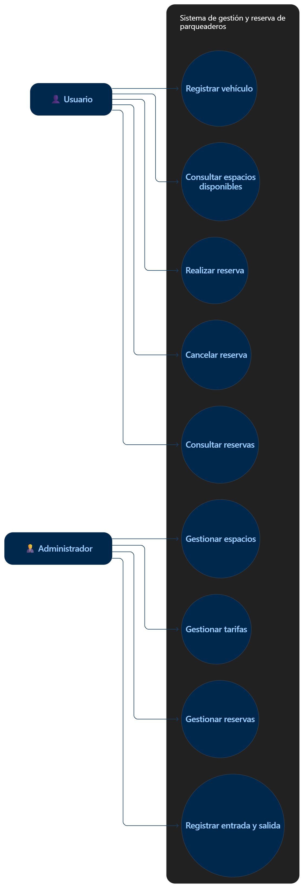
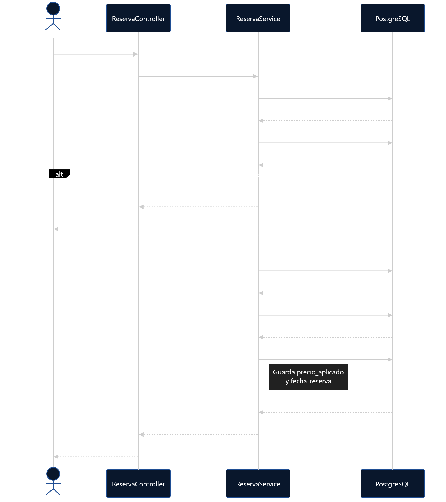
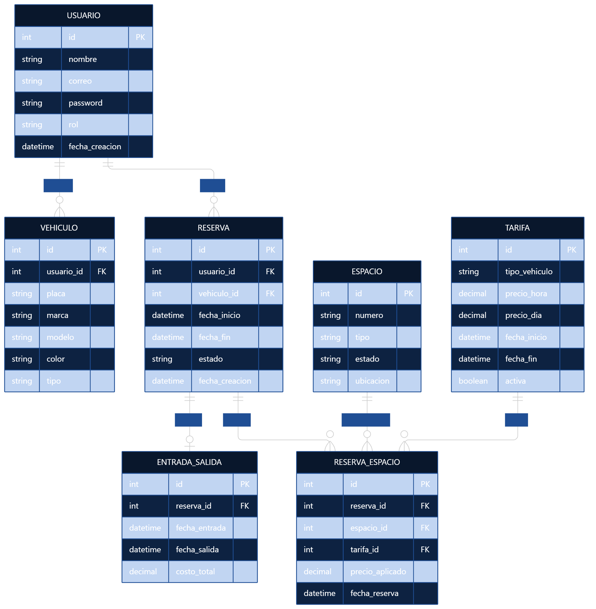

# Sistema de Gestión y Reserva de Parqueaderos

## Descripción del dominio

El sistema permite gestionar y reservar espacios de parqueaderos de manera organizada.
Los usuarios pueden registrar sus vehículos y consultar los espacios disponibles.
También pueden realizar, consultar y cancelar reservas para un espacio determinado.
Los administradores pueden gestionar espacios, tarifas, reservas y registrar las entradas y salidas de los vehículos.
El sistema busca evitar conflictos de reservas y calcular correctamente el costo del servicio según las tarifas establecidas.

## Diagramas

Los diagramas del proyecto se encuentran en la carpeta `docs/`.

### Diagrama de casos de uso

### Diagrama de secuencia

### Diagrama de clases

