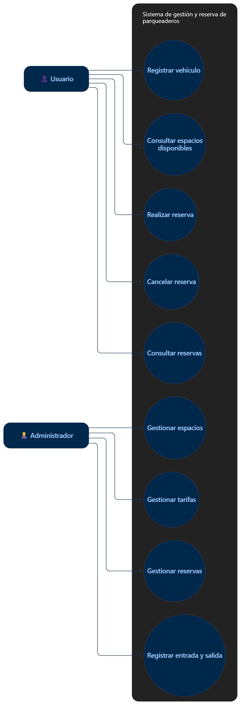
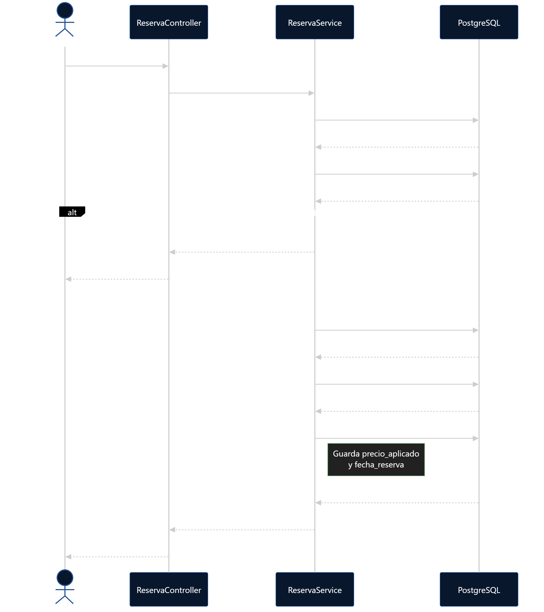
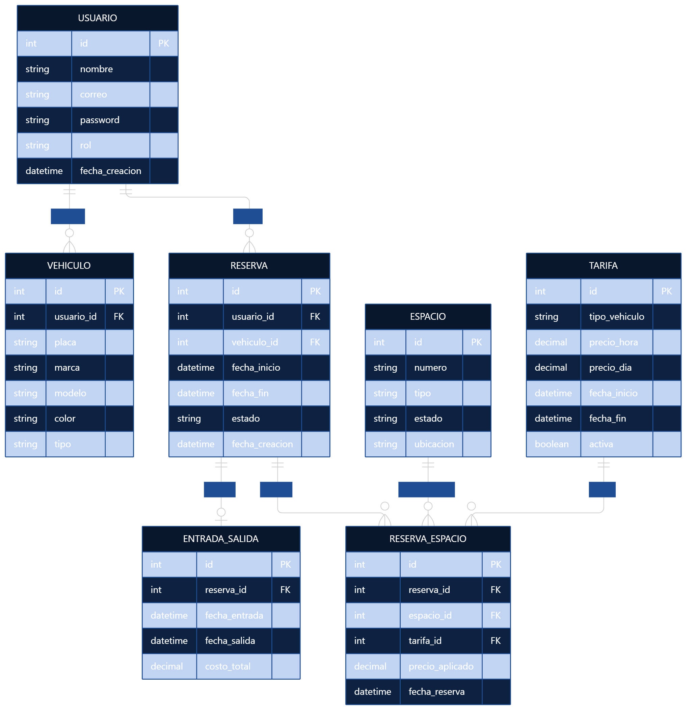
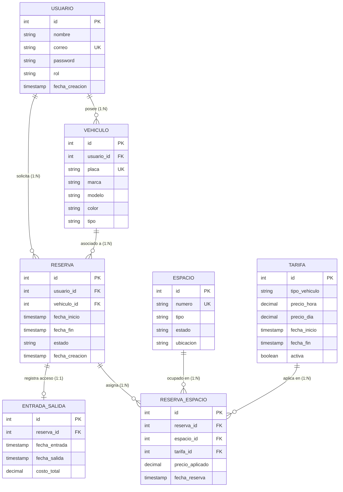
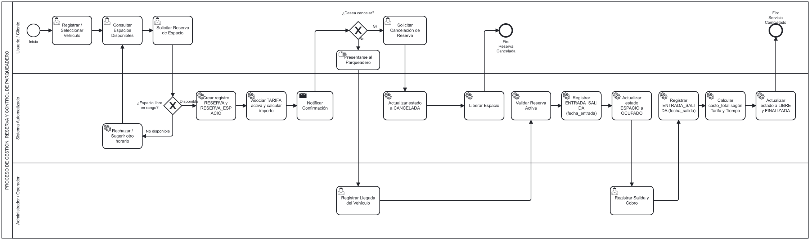

# Sistema de Gestión y Reserva de Parqueaderos

## Descripción del dominio

El sistema permite gestionar y reservar espacios de parqueaderos de manera organizada.
Los usuarios pueden registrar sus vehículos y consultar los espacios disponibles.
También pueden realizar, consultar y cancelar reservas para un espacio determinado.
Los administradores pueden gestionar espacios, tarifas, reservas y registrar las entradas y salidas de los vehículos.
El sistema busca evitar conflictos de reservas y calcular correctamente el costo del servicio según las tarifas establecidas.

---

## 🚀 API REST (Express)

El proyecto cuenta con una API REST desarrollada en Node.js utilizando **Express**, estructurada bajo una arquitectura de tres capas.

- **Documentacion en Postman**: [Documentacion Servicios REST](https://documenter.getpostman.com/view/10014372/2sBYHNVhYa)

### Arquitectura de Capas

- **Routes (`src/routes/`)**: Define las URLs y métodos HTTP de los endpoints.
- **Controllers (`src/controllers/`)**: Capa de presentación HTTP. Recibe la petición (`req`), extrae parámetros/body, llama al servicio y formatea la respuesta (`res`) manejando los códigos de estado HTTP correspondientes.
- **Services (`src/services/`)**: Capa de negocio y datos. Ejecuta las validaciones de negocio del dominio, procesa la información y no tiene conocimiento del contexto HTTP.

### Middlewares Implementados

- **Morgan**: Registro de peticiones HTTP en consola.
- **express-validator**: Middleware central en `src/middlewares/validar.js` para recolectar errores. Las reglas de validación se configuran por ruta, protegiendo a la API de datos inválidos (corta la petición con 400 Bad Request y un reporte detallado).
- **Manejo de Errores Centralizado**: Middleware (`src/middlewares/errores.js`) que procesa excepciones capturadas globalmente. En conjunto con la clase `ErrorHttp` (`src/errores.js`), permite lanzar errores descriptivos desde los `Services` (ej: 404, 409) limpiando los `Controllers` de condicionales HTTP.
- **Modo Mantenimiento**: Middleware global (`src/middlewares/mantenimiento.js`) que bloquea la API con un código `503` si la variable de entorno `MANTENIMIENTO=true` está configurada.
- **API Key**: Middleware de protección (`src/middlewares/apiKey.js`) aplicado a rutas específicas, exigiendo el header `x-api-key`.
- **Autenticación y Roles**: Middlewares (`src/middlewares/auth.js`):
  - `autenticarUsuario`: Valida el token de sesión en el header `Authorization: Bearer <token>`.
  - `requiereRol(...roles)`: Autoriza el acceso únicamente a los roles indicados (ej: `administrador`, `cliente`).

### Usuarios de Prueba (En Memoria)

| Rol             | Correo                  | Contraseña   |
| --------------- | ----------------------- | ------------ |
| `administrador` | `admin@parqueadero.com` | `admin123`   |
| `cliente`       | `carlos@cliente.com`    | `cliente123` |
| `cliente`       | `maria@cliente.com`     | `cliente123` |

### Endpoints

#### Autenticación (`/api/auth`)

| Método | Endpoint             | Descripción                                               | Acceso         |
| ------ | -------------------- | --------------------------------------------------------- | -------------- |
| `POST` | `/api/auth/registro` | Registrar un nuevo usuario (rol por defecto: `cliente`)   | Público        |
| `POST` | `/api/auth/login`    | Iniciar sesión (retorna token Bearer y datos del usuario) | Público        |
| `GET`  | `/api/auth/perfil`   | Consultar perfil del usuario autenticado                  | Requiere Token |
| `POST` | `/api/auth/logout`   | Cerrar sesión e invalidar token                           | Requiere Token |

#### Usuarios (`/api/usuarios`)

| Método | Endpoint            | Descripción               | Acceso                             |
| ------ | ------------------- | ------------------------- | ---------------------------------- |
| `GET`  | `/api/usuarios`     | Listar todos los usuarios | Solo `administrador`               |
| `GET`  | `/api/usuarios/:id` | Ver usuario por ID        | `administrador` o el mismo usuario |

#### Espacios (`/api/espacios`)

| Método   | Endpoint                     | Descripción                                                    |
| -------- | ---------------------------- | -------------------------------------------------------------- |
| `GET`    | `/`                          | Estado de la API                                               |
| `GET`    | `/api/espacios`              | Listar todos los espacios                                      |
| `GET`    | `/api/espacios?estado=libre` | Filtrar espacios por estado (ej: libre, ocupado)               |
| `GET`    | `/api/espacios?tipo=moto`    | Filtrar espacios por tipo (ej: carro, moto)                    |
| `GET`    | `/api/espacios/:id`          | Ver detalles de un espacio específico                          |
| `POST`   | `/api/espacios`              | Crear un nuevo espacio (aplica validaciones de negocio)        |
| `PUT`    | `/api/espacios/:id`          | Actualizar la información de un espacio existente              |
| `DELETE` | `/api/espacios/:id`          | Eliminar un espacio (Requiere Header: `x-api-key: secreta123`) |

### Cómo ejecutar el proyecto

1. Instalar las dependencias:
   ```bash
   npm install
   ```
2. Arrancar el servidor en modo desarrollo (con auto-recarga gracias a Nodemon):
   ```bash
   npm run dev
   ```
3. La API estará disponible en: `http://localhost:3000`

> [!NOTE]
> Se proveerá una colección de Postman oficial del proyecto ubicada en `docs/postman/` (Avance 1) con peticiones pre-configuradas para probar los diferentes casos de éxito y de error de la API.

---

## Diagramas

Los diagramas de diseño del proyecto se encuentran en la carpeta `docs/`.

### Diagrama de casos de uso



### Diagrama de secuencia



### Diagrama de clases



### Modelo Entidad-Relación


```mermaid
erDiagram
    USUARIO ||--o{ VEHICULO : "posee (1:N)"
    USUARIO ||--o{ RESERVA : "solicita (1:N)"
    VEHICULO ||--o{ RESERVA : "asociado a (1:N)"
    RESERVA ||--o{ RESERVA_ESPACIO : "asigna (1:N)"
    ESPACIO ||--o{ RESERVA_ESPACIO : "ocupado en (1:N)"
    TARIFA ||--o{ RESERVA_ESPACIO : "aplica en (1:N)"
    RESERVA ||--o| ENTRADA_SALIDA : "registra acceso (1:1)"

    USUARIO {
        int id PK
        string nombre
        string correo UK
        string password
        string rol
        timestamp fecha_creacion
    }

    VEHICULO {
        int id PK
        int usuario_id FK
        string placa UK
        string marca
        string modelo
        string color
        string tipo
    }

    ESPACIO {
        int id PK
        string numero UK
        string tipo
        string estado
        string ubicacion
    }

    TARIFA {
        int id PK
        string tipo_vehiculo
        decimal precio_hora
        decimal precio_dia
        timestamp fecha_inicio
        timestamp fecha_fin
        boolean activa
    }

    RESERVA {
        int id PK
        int usuario_id FK
        int vehiculo_id FK
        timestamp fecha_inicio
        timestamp fecha_fin
        string estado
        timestamp fecha_creacion
    }

    RESERVA_ESPACIO {
        int id PK
        int reserva_id FK
        int espacio_id FK
        int tarifa_id FK
        decimal precio_aplicado
        timestamp fecha_reserva
    }

    ENTRADA_SALIDA {
        int id PK
        int reserva_id FK
        timestamp fecha_entrada
        timestamp fecha_salida
        decimal costo_total
    }
```

### Diagrama BPMN


